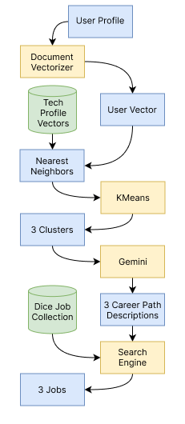

# LinkedIn Career Path Navigator
> Data Collection Lab (094290) - Technion

[Be sure to check out our project poster!](assets/project_poster.pdf)

## Introduction
Our project is centered on the development of an AI-driven system designed to enhance the experience of end-users. The primary objective of this system is to assist users in navigating their career development journey by offering personalized insights and recommendations across a range of potential career paths. 

The system aims to provide users with exposure to three distinct career paths that align with their profiles by comparing their interests and qualifications with those of other LinkedIn users in similar fields. We found it beneficial to have a tool that could suggest the next potential step in a career path, based on the similarities to others. Suggesting a job based on similar profiles could potentially increase the diversity of the suggestions while keeping them within the areas of interest.

## Our pipeline

## Running the Code
The project consists of two parts: [`PROJECT.ipynb`](PROJECT.ipynb) (notebook) [`job_search_engine.py`](job_search_engine.py) (script).
- The notebook contains most of the other pipline, starting from the data preprocessing up to the integration with Gemini.
- The job search script contains the last part of the pipeline, which is the job search based on Gemini's results.

To run the notebook, you need access to the course's Databricks environment. Just upload the notebook and run it.
To run the search engine, install the libraries listed in [`requirements.txt`](requirements.txt) and run like any other python script (We were using Python 3.11).

## Scraping [_Dice.com_](https://dice.com/)
For the data collection part of the project, we have scraped [Dice.com](https://dice.com/) for **public** tech job postings.
The scraping code can be found in [`scraping.py`](scraping.py) and the post-processing of the scraping results is done in [`to_jsonl.py`](to_jsonl.py).

> [!NOTE]
> The scraping was done using [BrightData's Datacenter Proxy](https://brightdata.com/proxy-types/datacenter-proxies) Solution.

## Job Search Engine
The job search engine is using the [`retriv`](https://github.com/AmenRa/retriv/tree/main) library. The library excepts json lines (.jsonl) as an input. 
The [`to_jsonl.py`](to_jsonl.py) script generated this file. To run this file you will need to place the scraped jobs in a folder called "dice" in the same folder as the script. Contact us for the scraped jobs.
